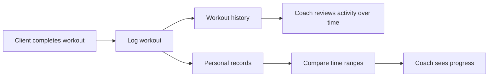
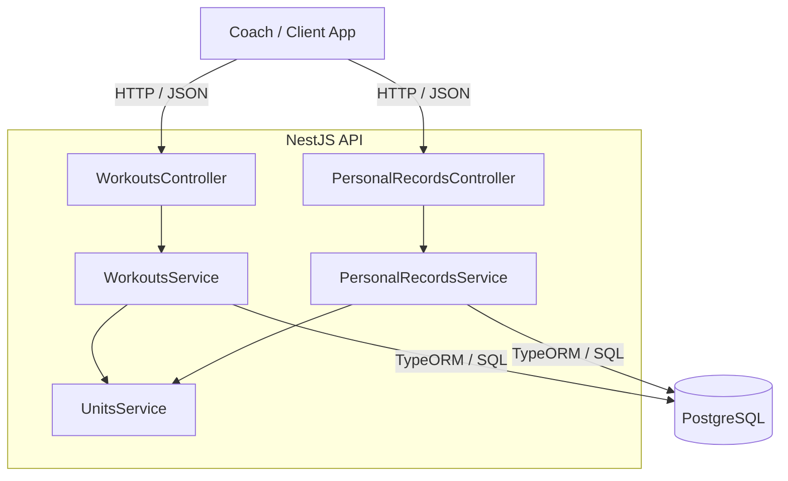
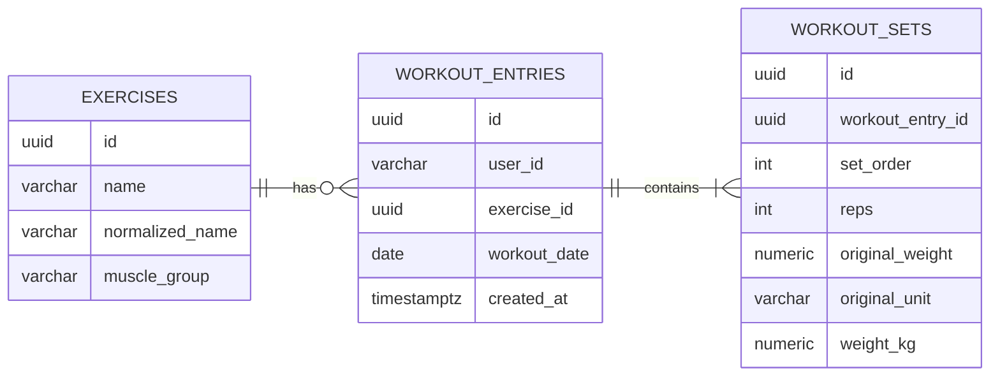

# Everfit Workout API

A NestJS + PostgreSQL backend for Everfit-style workout tracking: log what a client completed, review workout history, calculate personal records, and compare progress across time ranges.

## What this service does

The API is built around four product operations:

1. **Log a workout** — record one workout date with one or more exercises and their sets.
2. **Review workout history** — filter a client's past activity by exercise name, date range, muscle group, and display unit.
3. **Calculate personal records** — derive the heaviest set, highest-volume set, and best Epley estimated 1RM for an exercise.
4. **Compare progress** — calculate the same PRs independently for two time ranges so a coach can compare performance over time.

`userId` is passed as a request parameter, as required by the assignment. Authentication is intentionally out of scope for this take-home.

## Core business flow



The same flow drives the API design: raw workout results are written once, history reads those results, PR queries derive performance from the stored sets, and range comparison applies the PR rules to two independent periods.

## Architecture at a glance

The service stays deliberately small: one stateless NestJS application owns the HTTP/use-case layer, while PostgreSQL is the source of truth.



Controllers stay thin; services implement the use cases; unit conversion is centralized; and migrations own the schema. Redis, queues, search engines, and microservices are intentionally not introduced without a requirement or measured need.

## Data model at a glance



- **`exercises`** is the shared exercise identity plus configurable muscle-group metadata.
- **`workout_entries`** represents one exercise occurrence for one user on one workout date; repeated same-day entries are valid.
- **`workout_sets`** preserves submitted set order and original weight/unit while also storing decimal-safe canonical kilograms.

See [`docs/database-design.md`](docs/database-design.md) for schema constraints, indexes, query shapes, and concurrency details.

## Key engineering decisions

- **Canonical weight for calculations.** The API preserves the submitted value/unit for display, but persists canonical kg so history conversion and PR ranking stay consistent across kg/lb inputs.
- **Atomic bulk logging.** One `POST` request is one transaction. If any exercise/set fails validation or persistence, none of the request is committed.
- **Keyset history pagination.** History orders by `(workout_date DESC, created_at DESC, id DESC)` and uses a filter-bound opaque cursor instead of deep offset paging.
- **PR calculation in PostgreSQL.** Heaviest set, volume (`reps × weight`), and Epley 1RM are ranked independently on canonical kg with deterministic tie rules.
- **Explicit date model.** `workout_date` is the client-supplied calendar day; `created_at` is UTC ingestion time and is never presented as the workout time.
- **Configurable exercise metadata.** Exercise-to-muscle-group mapping is loaded from configuration rather than hard-coded into business logic.
- **Versioned schema and production boundaries.** Migrations own schema changes, request sizes are bounded, configuration is validated, and readiness checks include database connectivity.

## Quick start

Prerequisites: Node.js 22, pnpm 10.28.2 (pinned in `package.json` and the Docker build), and Docker.

### Option A: everything in Compose (reproducible path)

```sh
DB_PASSWORD=choose-a-local-password docker compose up --build
```

Compose starts `postgres`, runs the one-shot `migrate` service (versioned migrations), and only then starts `app`. The API listens on `http://localhost:3000` (or `PORT` from the environment/`.env`, e.g. 3100 after `cp .env.example .env`); PostgreSQL is bound to `127.0.0.1:${DB_PORT:-55432}`; set `DB_PORT` if that host port is already in use.

### Option B: API on the host, PostgreSQL in Docker

```sh
cp .env.example .env              # DB on 127.0.0.1:55432, API on port 3100, DB_PASSWORD=everfit
docker compose up -d postgres     # start only PostgreSQL; Compose reads DB_PASSWORD/DB_PORT from .env
pnpm install
pnpm migration:run                # apply versioned migrations
pnpm start:dev                    # http://localhost:3100
```

`pnpm start:dev` does not start a database; PostgreSQL must be running and migrated first. Stop it with `docker compose down` (add `-v` to delete the local volume).

On startup the app validates and inserts any missing rows from the configurable exercise catalog. Versioned migrations own database schema changes.

Health endpoints are `/health`, `/health/live`, and `/health/ready`. OpenAPI is available at `/docs`, and the interactive Scalar API reference is available at `/reference` for trying the endpoints directly.

Schema synchronization is disabled by default (`DB_SYNCHRONIZE=false`). Migrations own schema changes; `synchronize=true` is only an explicit disposable-local escape hatch, not a production setup.

```sh
pnpm build
pnpm lint
pnpm test          # contract/unit suite, no database
pnpm test:e2e      # DB-backed suite; needs the local PostgreSQL configuration
pnpm migration:show
```

`pnpm test:e2e` uses disposable PostgreSQL databases; do not point the E2E database variables at data you want to keep. The workflow suite exercises HTTP behavior, while `test/migrations.e2e-spec.ts` separately boots the app from versioned migrations with `DB_SYNCHRONIZE=false`.

## API at a glance

The running service exposes four business operations. Use the interactive **Scalar API reference at `/reference`** to execute requests against the running service; the complete request/response contract lives in [`docs/api-design.md`](docs/api-design.md).

| Method | Endpoint | Purpose |
| --- | --- | --- |
| `POST` | `/v1/users/:userId/workouts` | record completed exercises and sets |
| `GET` | `/v1/users/:userId/workouts` | filter and page workout history |
| `GET` | `/v1/users/:userId/personal-records` | calculate three PR metrics for an exercise |
| `GET` | `/v1/users/:userId/personal-records/compare` | compare PRs across two explicit date ranges |

The API uses structured validation errors, treats valid no-data reads as `200`, keeps bulk workout logging atomic, and binds history cursors to their query scope. See the API design document for examples, filters, pagination, error codes, and response shapes.

## Verification at a glance

The implementation is verified with build/lint gates, unit tests, PostgreSQL-backed E2E tests, migration-backed startup tests, and a deterministic 50k-entry query-plan harness. The latest recorded verification on this branch passed `pnpm build`, `pnpm lint`, 36/36 unit tests, 23/23 DB-backed E2E tests, and 2/2 migration E2E tests.

The 50k harness uses 50,000 workout entries and 174,823 sets to inspect the main history and PR query shapes with `EXPLAIN (ANALYZE, BUFFERS)`. Those measurements are SQL query-plan evidence, not HTTP throughput or proof of 10k concurrent-coach capacity.

See [`docs/verification.md`](docs/verification.md) for the exact test evidence, runtime safeguards, performance measurements, limitations, and reproduction commands.

## Trade-offs

- Authentication is not implemented because the assignment explicitly passes `userId` as a request parameter.
- Catalog muscle-group changes affect later history filtering of older entries.
- The cursor scope hash detects query mismatch but is not a signed security token, and pagination is not snapshot-consistent during concurrent writes.
- The service intentionally avoids Redis, queues, search infrastructure, and extra services until measurements justify them.
- Scaling to 10k concurrent coaches would require HTTP load testing plus evidence-driven changes such as horizontal API replicas, disciplined DB pooling/PgBouncer, query/index refinement, and read projections or replicas where measurement supports them.

## Documentation

- [`docs/README.md`](docs/README.md) — documentation map and recommended reading path.
- [`docs/architecture.md`](docs/architecture.md) — system shape, module boundaries, request flows, and scaling stance.
- [`docs/api-design.md`](docs/api-design.md) — full HTTP contract, request/response examples, filtering, pagination, no-data semantics, and errors.
- [`docs/database-design.md`](docs/database-design.md) — schema, transactions, indexes, and query design.
- [`docs/verification.md`](docs/verification.md) — build/test evidence, runtime safeguards, and 50k performance evidence.
- [`docs/decisions/`](docs/decisions/) — focused architecture decision records.
- [`AI_WORKFLOW.md`](AI_WORKFLOW.md) — AI tools, rejected suggestions, incorrect outputs, corrections, and verification loop.

Supporting raw measurements and historical working material are kept under [`notes/`](notes/README.md), separate from the current system documentation.
