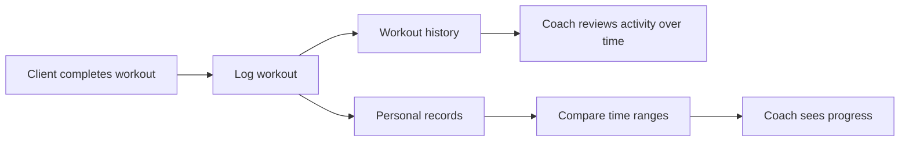
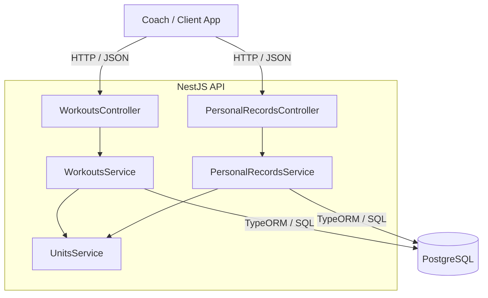
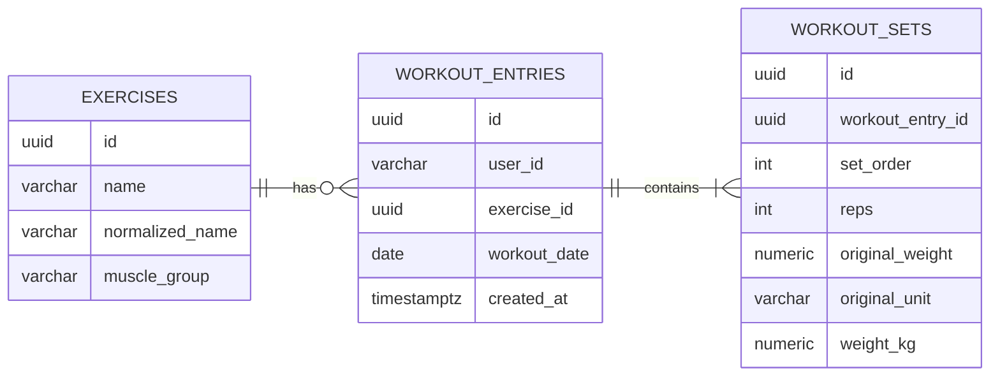
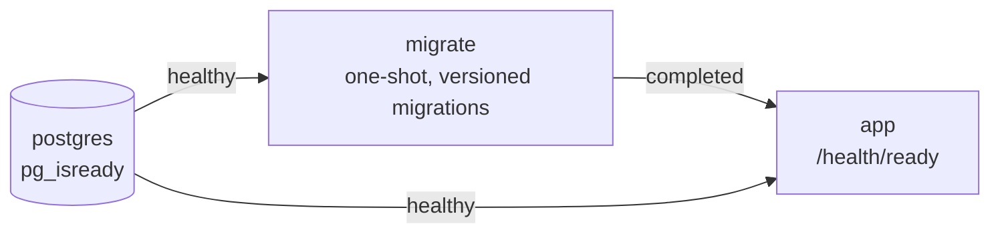
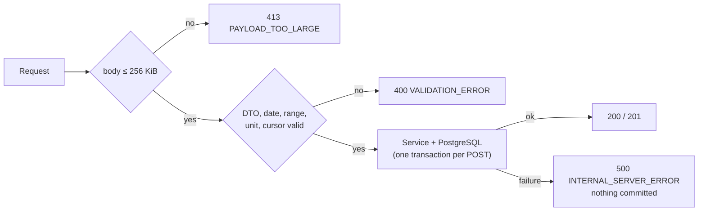
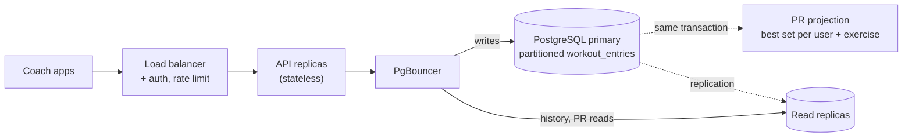

# Everfit Workout API

A NestJS + PostgreSQL backend for Everfit-style workout tracking: log what a client completed, review workout history, calculate personal records, and compare progress across time ranges.

## What this service does

The API is built around four product operations:

1. **Log a workout** — record one workout date with one or more exercises and their sets.
2. **Review workout history** — filter a client's past activity by exercise name, date range, muscle group, and display unit.
3. **Calculate personal records** — derive the heaviest set, highest-volume set, and best Epley estimated 1RM for an exercise.
4. **Compare progress** — calculate the same PRs independently for two time ranges so a coach can compare performance over time.

`userId` is passed as a request parameter, as required by the assignment. Authentication is intentionally out of scope for this take-home.

## Core business flow



The same flow drives the API design: raw workout results are written once, history reads those results, PR queries derive performance from the stored sets, and range comparison applies the PR rules to two independent periods.

## Architecture at a glance

The service stays deliberately small: one stateless NestJS application owns the HTTP/use-case layer, while PostgreSQL is the source of truth.



Controllers stay thin; services implement the use cases; unit conversion is centralized; and migrations own the schema. Redis, queues, search engines, and microservices are intentionally not introduced without a requirement or measured need.

See [`docs/architecture.md`](docs/architecture.md) for module responsibilities, request flows, operational boundaries, and scaling decisions.

## Data model at a glance



- **`exercises`** is the shared exercise identity plus configurable muscle-group metadata.
- **`workout_entries`** represents one exercise occurrence for one user on one workout date; repeated same-day entries are valid.
- **`workout_sets`** preserves submitted set order and original weight/unit while also storing decimal-safe canonical kilograms.

Personal records are computed from these tables at read time; there is no separate PR entity or table.

See [`docs/database-design.md`](docs/database-design.md) for schema constraints, indexes, query shapes, and concurrency details.

## Key engineering decisions

- **Canonical weight for calculations.** The API preserves the submitted value/unit for display, but persists canonical kg so history conversion and PR ranking stay consistent across kg/lb inputs.
- **Atomic bulk logging.** One `POST` request is one transaction. If any exercise/set fails validation or persistence, none of the request is committed.
- **Keyset history pagination.** History orders by `(workout_date DESC, created_at DESC, id DESC)` and uses a filter-bound opaque cursor instead of deep offset paging.
- **PR calculation in PostgreSQL.** Heaviest set, volume (`reps × weight`), and Epley 1RM are ranked independently on canonical kg with deterministic tie rules.
- **Explicit date model.** `workout_date` is the client-supplied calendar day; `created_at` is UTC ingestion time and is never presented as the workout time.
- **Configurable exercise metadata.** Exercise-to-muscle-group mapping is loaded from configuration rather than hard-coded into business logic.
- **Versioned schema and production boundaries.** Migrations own schema changes, request sizes are bounded, configuration is validated, and readiness checks include database connectivity.

## Setup

Prerequisite: Docker. One command takes a fresh clone to a running, migrated API:

```sh
DB_PASSWORD=choose-a-local-password docker compose up --build
```

`DB_PASSWORD` is required on purpose: the container runs with `NODE_ENV=production`, which refuses a missing or default password.



| URL | What |
| --- | --- |
| `http://localhost:3000/reference` | Scalar — try every endpoint in the browser |
| `http://localhost:3000/docs` | Swagger UI / OpenAPI |
| `http://localhost:3000/health/ready` | readiness, includes a database check |

- Port busy? Prefix `PORT=3100` and/or `DB_PORT=55433`. PostgreSQL binds to `127.0.0.1` only.
- Reset data: `docker compose down -v`.
- Schema changes come only from migrations (`DB_SYNCHRONIZE=false`); the exercise catalog in `config/exercises.json` is seeded on startup.

<details>
<summary>Run the API on the host (development, tests)</summary>

Requires Node.js 22 and pnpm 10.28.2 (pinned in `package.json` and the Docker build).

```sh
cp .env.example .env              # development defaults: API on 3100, DB on 127.0.0.1:55432
docker compose up -d postgres     # database only
pnpm install
pnpm migration:run
pnpm start:dev                    # http://localhost:3100

pnpm build && pnpm lint
pnpm test                         # unit/contract suite, no database
pnpm test:e2e                     # creates and drops disposable PostgreSQL databases
```

Do not point the E2E database variables at data you want to keep. `test/migrations.e2e-spec.ts` boots the app from versioned migrations with `DB_SYNCHRONIZE=false`.

</details>

## API at a glance

Base path `/v1`. Full contract: [`docs/api-design.md`](docs/api-design.md). Interactive: `/reference`.

| Method | Endpoint | Purpose | Success |
| --- | --- | --- | --- |
| `POST` | `/v1/users/:userId/workouts` | log exercises + sets for one date (atomic) | `201` |
| `GET` | `/v1/users/:userId/workouts` | history: `exerciseName`, `from`, `to`, `muscleGroup`, `unit`, `limit`, `cursor` | `200` |
| `GET` | `/v1/users/:userId/personal-records` | heaviest set, highest volume, Epley 1RM: `exerciseName`, `from`, `to`, `unit` | `200` |
| `GET` | `/v1/users/:userId/personal-records/compare` | same PRs for two ranges: `rangeAFrom/To`, `rangeBFrom/To` | `200` |

**Log a workout**

`POST /v1/users/client-42/workouts`

```json
{
  "date": "2026-09-25",
  "exercises": [
    {
      "exerciseName": "Bench Press",
      "sets": [
        { "reps": 5, "weight": 100, "unit": "kg" },
        { "reps": 8, "weight": 180, "unit": "lb" }
      ]
    }
  ]
}
```

`201 Created`

```json
{
  "entries": [
    {
      "id": "f208022b-…",
      "exerciseName": "Bench Press",
      "date": "2026-09-25",
      "sets": [
        { "id": "601c48e5-…", "reps": 5, "weight": 100, "unit": "kg" },
        { "id": "de8ca036-…", "reps": 8, "weight": 180, "unit": "lb" }
      ]
    }
  ]
}
```

Reads return `200` even with no data: history returns `items: []`, PRs return `null` records, both with a short `message`. History pages with `page: { limit, hasMore, nextCursor }`.

### Errors



Every error uses one envelope:

```json
{
  "statusCode": 400,
  "code": "VALIDATION_ERROR",
  "message": "Request validation failed",
  "details": ["exercises.0.sets.0.reps must not be less than 1"],
  "requestId": "b3f1c2d4-…"
}
```

| Status | `code` | Cause |
| --- | --- | --- |
| `400` | `VALIDATION_ERROR` | bad body/query, unknown field, invalid date or range, unsupported unit, cursor from another query |
| `404` | `HTTP_404` | unknown route |
| `413` | `PAYLOAD_TOO_LARGE` | body over 256 KiB |
| `500` | `INTERNAL_SERVER_ERROR` | unexpected failure; `details: null`, no stack trace |

## Verification at a glance

| Layer | What it proves | Run | Result |
| --- | --- | --- | --- |
| Unit — calculations | kg/lb conversion, half-up rounding, round-trip without drift, volume, calendar dates, name identity | `pnpm test` | 75/75 |
| Unit — contracts | DTO validation, cursor scope, error envelope, PR mapping, config, catalog | `pnpm test` | (included) |
| Integration — HTTP + PostgreSQL | all 4 endpoints: invalid bulk request persists nothing, concurrency, cursor paging (incl. full date + created_at ties), PR ranking (independent winners, date ties, inclusive ranges, lb output), 400 cases | `pnpm test:e2e` | 33/33 |
| Migrations | fresh DB built only from versioned migrations, `DB_SYNCHRONIZE=false` | `pnpm test:e2e` | (included) |
| Docker | fresh clone → `docker compose up --build` → healthy, all endpoints + 400/413 | manual smoke | pass |

PR ranking itself runs in SQL, so its tests are integration tests against real PostgreSQL rather than mocks. A previous 50k-entry run inspected query plans only, **not** HTTP throughput. Details: [`docs/verification.md`](docs/verification.md).

## Trade-offs

| Decision | Gain | Cost |
| --- | --- | --- |
| `userId` in the path, no auth | matches the brief | any caller can read or write any user |
| PRs computed at read time from sets | always consistent, no sync logic | 3 ranking queries per range; cost grows with history |
| Canonical kg stored next to the original value | exact cross-unit ranking | two weight columns per set |
| Muscle group read from the live catalog | config edit re-labels history instantly | old entries are re-categorized too |
| Keyset cursor bound to a query hash | stable deep paging, catches misuse | not signed; not snapshot-consistent under concurrent writes |
| One NestJS service + PostgreSQL | simple to run and reason about | no cache or queue until measurements ask for one |

## What I would change at scale

Measure first (HTTP load test at the target coach concurrency), then apply what the numbers point to:



| Pressure | Today | Change |
| --- | --- | --- |
| DB connections | one `compare` runs 6 queries in parallel on a pool of 10 | PgBouncer; cap per-request parallelism or merge the 3 metrics into one windowed query |
| PR latency grows with history | ranks every matching set on each read | projection table updated in the log transaction (all-time PRs); keep read-time ranking for custom ranges |
| Read volume | primary serves everything | route history/PR reads to replicas |
| Table growth | single `workout_entries` / `workout_sets` | partition by `workout_date` (or hash of `user_id`) |
| `muscleGroup` filter | `LOWER(muscle_group)` without an index | store normalized value + index, or resolve to `exercise_id`s first |
| Security | open `userId`, unsigned cursor | JWT with coach → client authorization, HMAC-signed cursors, per-coach rate limits |

## Documentation

- [`docs/README.md`](docs/README.md) — documentation map and recommended reading path.
- [`docs/architecture.md`](docs/architecture.md) — system shape, module boundaries, request flows, and scaling stance.
- [`docs/api-design.md`](docs/api-design.md) — full HTTP contract, request/response examples, filtering, pagination, no-data semantics, and errors.
- [`docs/database-design.md`](docs/database-design.md) — schema, transactions, indexes, and query design.
- [`docs/verification.md`](docs/verification.md) — build/test evidence, runtime safeguards, and 50k performance evidence.
- [`docs/decisions/`](docs/decisions/) — focused architecture decision records.
- [`AI_WORKFLOW.md`](AI_WORKFLOW.md) — AI tools, rejected suggestions, incorrect outputs, corrections, and verification loop.

Supporting raw measurements and historical working material are kept under [`notes/`](notes/README.md), separate from the current system documentation.
