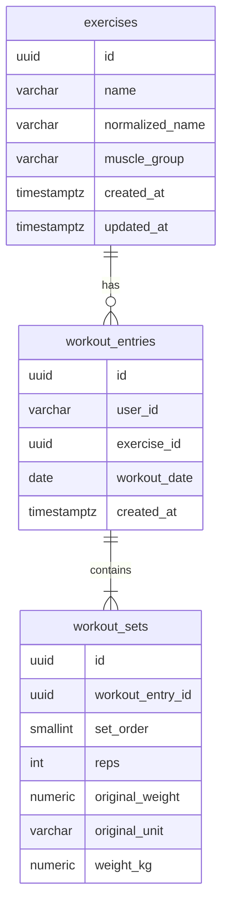

# Database Design

- **Source of truth:** `src/database/migrations/1770000000000-initial-schema.ts`.
- **Schema policy:** PostgreSQL + TypeORM use explicit versioned migrations; production `synchronize` is disabled/rejected.

## Schema at a glance



## Table responsibilities

### `exercises` — shared identity and metadata

- `normalized_name` is unique and uses application normalization: outer trim + lowercase only.
- Original display spelling is retained from first creation.
- `muscle_group` is nullable, configurable metadata loaded from the exercise catalog; it is not hard-coded in business logic.
- UUID primary keys default to `uuid_generate_v4()`.

### `workout_entries` — one exercise occurrence

- `user_id` is the caller-supplied opaque client ID.
- `exercise_id` references the shared exercise row.
- `workout_date` is PostgreSQL `DATE`, not a fabricated timestamp.
- `created_at` is UTC `TIMESTAMPTZ(6)` ingestion time used as a stable same-day ordering key.
- Same user/exercise/date may appear more than once by design.

### `workout_sets` — ordered set measurements

- `set_order` is 1-based and unique within one entry.
- `reps` is an integer `1..10000`.
- `original_weight NUMERIC(12,3)` and `original_unit` preserve submitted measurement semantics.
- `weight_kg NUMERIC(15,6)` is the canonical calculation value.
- Deleting an entry cascades to its sets.

## Why store original and canonical weight?

```text
submitted 225 lb
      │
      ├────────► original_weight = 225, original_unit = lb
      │
      └────────► decimal conversion ─────► weight_kg = 102.058284
                                              │
                                              ├─ history unit conversion
                                              └─ PR ranking / volume / 1RM
```

Canonical kg gives one comparison basis across units. Original values preserve what the caller sent. Conversion uses exact `1 lb = 0.45359237 kg` with decimal arithmetic; PR winners are selected from persisted canonical values before display rounding.

## Atomic write and concurrent exercise resolution

One logging request is one PostgreSQL transaction.

For each distinct normalized exercise name, the service executes `INSERT ... ON CONFLICT DO NOTHING RETURNING`. If another transaction already created the row, it performs a separate `SELECT` using the same transaction manager. This avoids a check-then-insert race while preserving curated metadata.

```text
BEGIN
  resolve/create exercises in deterministic name order
  insert workout_entries
  insert workout_sets
COMMIT
```

Any failure rolls back the entire request. There is no uniqueness constraint on `(user_id, exercise_id, workout_date)` because repeated same-day logging is valid.

## Indexes and the queries they support

| Index / constraint | Purpose |
| --- | --- |
| unique `exercises(normalized_name)` | identity, conflict-safe creation, exact PR lookup |
| `workout_entries(user_id, workout_date DESC, created_at DESC, id DESC)` | user history and keyset ordering |
| `workout_entries(user_id, exercise_id, workout_date DESC, created_at DESC, id DESC)` | exercise/date-scoped PR candidate entries |
| unique `workout_sets(workout_entry_id, set_order)` | ordered set lookup and uniqueness within entry |

History pages entries first, then loads sets. Optional partial-name and muscle-group filters join `exercises`. A leading-wildcard substring filter cannot use a normal B-tree for the name predicate, so `pg_trgm` was deliberately not added until evidence shows a need.

## PR query shape

PR candidate rows join `exercises → workout_entries → workout_sets`, filter by user, exact normalized exercise name, and optional inclusive date range, then independently rank:

- `weight_kg`;
- `reps * weight_kg`;
- `weight_kg * (1 + reps::NUMERIC / 30::NUMERIC)`.

Tie order after metric DESC is `workout_date ASC, created_at ASC, entry id ASC, set_order ASC, set id ASC`.

## Measured behavior and limits

One local 50k-entry run showed fast first-page history and ~31–34 ms PR query plans, but also exposed two limits: the expanded deep-page keyset predicate was used as an index filter rather than an index bound, and PR plans scanned all `workout_sets` in parallel. These are documented evidence, not hidden by the design.

See [the experiments log](../notes/experiments.md) and [raw evidence](../notes/evidence/README.md) for exact plans, timings, and caveats.

## Related decisions

- [ADR 001 — PostgreSQL](decisions/001-postgresql.md)
- [ADR 002 — Canonical weight normalization](decisions/002-canonical-weight-normalization.md)
- [ADR 003 — Workout date and timezone semantics](decisions/003-workout-date-and-timezone.md)
- [ADR 004 — Cursor pagination](decisions/004-cursor-pagination.md)
